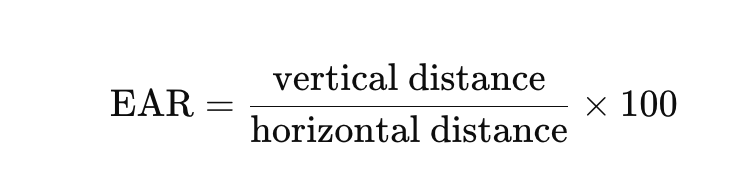
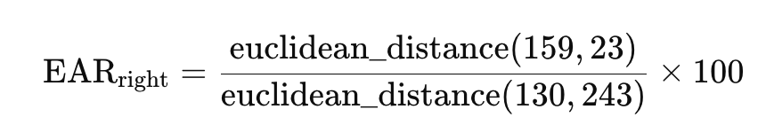
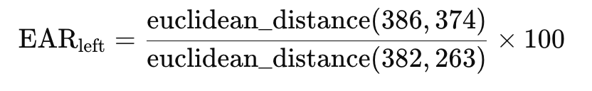
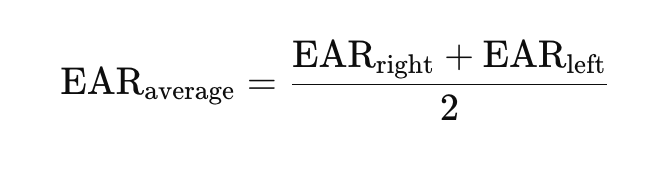
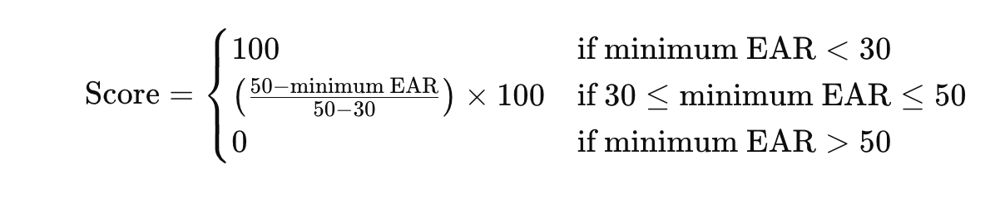
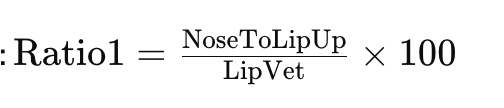
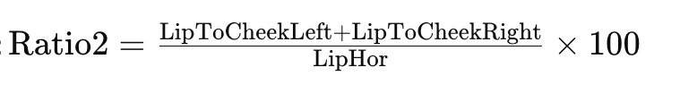
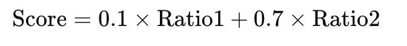
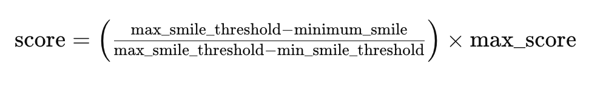

# Video KYC Verification 

## Overview
The Video KYC Verification App is designed to verify the identity of users through various recognition metrics. This app measures the Eye Blink Score, Smile Detection Score, and Hand Gesture Recognition Score (Victory or Thumbs Up). If the average of these three scores exceeds 90%, the KYC (Know Your Customer) process is considered verified. Additionally, the app allows users to record a video using WebRTC or upload an existing video, verifies the identity based on the scores, and generates a GIF and a DataFrame (df) of scores.

## Features
- **Eye Blink Score:** Detects and measures the frequency and accuracy of eye blinks.
- **Smile Detection Score:** Measures the authenticity and extent of the user's smile.
- **Hand Gesture Recognition Score:** Recognizes and scores hand gestures such as Victory (V sign) or Thumbs Up.
- **Average Score Calculation:** Calculates the average of the three scores to determine if it exceeds the 90% threshold for verification.
- **Video Recording:** Allows users to record a video using WebRTC.
- **Video Upload:** Provides an option to upload an existing video for analysis.
- **GIF Creation:** Generates a GIF from the video for visual verification.
- **Score DataFrame:** Creates a DataFrame containing the detailed scores for record-keeping and further analysis.
### How Scores are Calculated

#### Eye Blink Score Calculation

The Eye Blink Score is calculated using the Eye Aspect Ratio (EAR), which measures the distance between specific eye landmarks to detect eye blinks. The process involves several steps:

1. **Eye Aspect Ratio (EAR):**
   - **Formula:**
     

   - **For each eye:**
     
     

   - **Average EAR:**
     

2. **EAR Averaging:**
   - Smooth the EAR values over several frames to filter out noise and minor variations, ensuring only significant changes (blinks) are detected.

3. **Local Minima Detection:**
   - Identify local minima in the smoothed EAR values using the `argrelextrema` function. Local minima correspond to eye blinks.

4. **Scoring:**
   - Assign a score based on the frequency and characteristics of the detected blinks.
   - **Score Calculation:**
     


#### Smile Detection Score Calculation

#### Step 1: Facial Landmarks Used
The following facial landmarks are utilized in the Smile Detection Score calculation:
- **NoseDown:** Landmark ID: 2
- **LipupUp:** Landmark ID: 0
- **LipdownDown:** Landmark ID: 17
- **LipLeft:** Landmark ID: 291
- **LipRight:** Landmark ID: 61
- **ChickRight:** Landmark ID: 205
- **ChickLeft:** Landmark ID: 425

#### Step 2: Smile Metric Formulas and Weighting
- **Metric 1 - Vertical Lip Movement:**
  - **Formula:**
    
  - **Explanation:** Measures the proportion of the vertical distance between the nose tip and upper lip relative to the vertical length of the lips.
  
- **Metric 2 - Horizontal Lip Movement:**
  - **Formula:**
    
  - **Explanation:** Assesses lip curvature and cheek movement by calculating the percentage of the sum of the distances between each lip and cheek relative to the horizontal length of the lips.
  
- **Weighting Score:**
  - The overall Smile Detection Score Score is computed as a weighted average of Metric 1 and Metric 2:
    

#### Step 3: Selection of Score Using Variance and Minima
- The selection of the Smile Detection Score involves detecting local minima in the smoothed score values and assessing variance to ensure reliability.
- Variance is calculated around each local minimum to filter out noise and ensure significant smile events are captured accurately.

#### Step 4: Final Score Calculation
The Smile Detection Score is calculated using the following formula:



- **Explanation:**
  - minimum_smile: The minimum smile ratio obtained from the local minima.
  - min_smile_threshold: The minimum threshold for a valid smile ratio (set to 75).
  - max_smile_threshold: The maximum threshold for a valid smile ratio (set to 85).
  - max_score: The maximum score attainable (set to 100).

#### **Hand Gesture Recognition Score**:
   The gesture score is calculated based on the maximum probability of the detected hand gesture, scaled to a percentage (0-100). This probability is obtained from a keypoint classifier model applied to the hand landmarks extracted using the Mediapipe Hands library.

#### **Average Score Calculation**:
   - **Formula**: Average Score = (Eye Blink Score + Smile Detection Score + Hand Gesture Recognition Score) / 3
   - **Explanation**: The average score is computed by taking the mean of the individual scores. If the average score exceeds the 90% threshold, the KYC process is considered verified.


## Installation
1. Clone the repository:
    ```bash
    git clone https://github.com/P-197-719-971-C/Video_KYC.git
    ```
2. Install the required dependencies:
    ```bash
    pip install -r requirements.txt
    ```
## Running the Streamlit App

    streamlit run app.py


## Usage
### Recording a Video:
1. Navigate to the video recording section of the app.
2. Allow camera access when prompted.
3. Click on the "Record" button to start recording.
4. Once the recording is complete, click "Stop" and the video will be processed.

### Uploading a Video:
1. Navigate to the video upload section of the app.
2. Click on the "Upload" button and select the video file from your device.
3. The video will be processed upon upload.

### Verification Process:
- The app will analyze the video to compute the Eye Blink Score, Smile Detection Score, and Hand Gesture Recognition Score.
- If the average score of these metrics is above 90%, the video KYC is marked as verified.
- A GIF of the video and a DataFrame containing the scores will be generated and stored.

## Output
- **GIF:** A visual representation of the user's gestures and expressions during the video.
- **DataFrame:** A detailed table of scores, including:
    - Eye Blink Score
    - Smile Detection Score
    - Hand Gesture Recognition Score
    - Average Score

## Example DataFrame

| Metric                        | Eye Blink Score | Smile Detection Score | Hand Gesture Recognition Score | Average Score |
|-------------------------------|-----------------|-----------------------|--------------------------------|---------------|
| Score                         | 95.00%          | 92.50%                | 91.00%                         | 92.83%        |


## Verification Criteria
- If the Average Score is greater than 90%, the KYC is verified.
- If the Average Score is 90% or below, the KYC is not verified.

## Contributing
1. Fork the repository.
2. Create a new branch (`git checkout -b feature/your-feature`).
3. Commit your changes (`git commit -am 'Add some feature'`).
4. Push to the branch (`git push origin feature/your-feature`).
5. Create a new Pull Request.

## License
This project does not have a specific license and is provided as-is without any warranty. Feel free to use and modify it for non-commercial purposes. See the individual files for any third-party licenses or credits.


## Contact
For any queries or support, please contact:

Umrav Singh Shekhawat : umravsinghnbd@gmail.com


